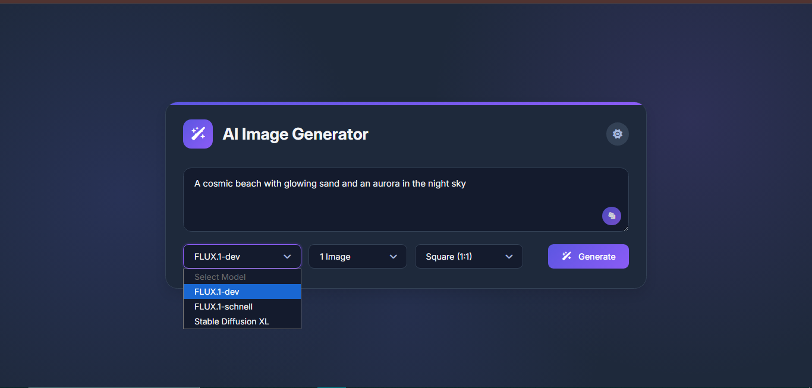

# AI Text-to-Image Generator

A web application that generates images from text prompts using AI models.
Users can enter a prompt, choose an AI model, select the number of images and aspect ratio, and generate images dynamically.

## Features

* Generate images from text prompts using AI models
* Multiple model selection (FLUX, Stable Diffusion XL)
* Choose number of images to generate
* Select image aspect ratio
* Image gallery with download option
* Random prompt generator
* Dark / Light theme toggle
* Responsive UI

## Tech Stack

* HTML
* CSS
* JavaScript
* Hugging Face Inference API

## Setup

1. Clone the repository
2. Add your Hugging Face API key in `app.js`

```
const API_Key = "ADD_YOUR_HUGGINGFACE_API_KEY"
```

3. Open `index.html` in your browser

## Preview


